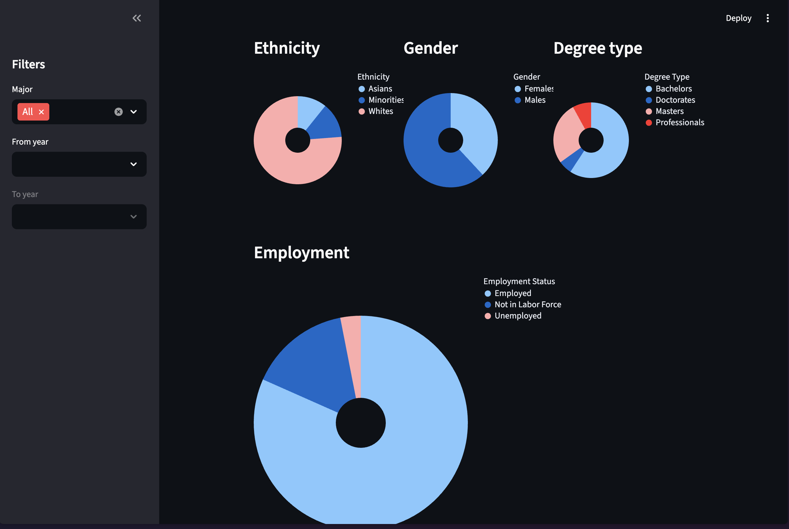

# New Grad Opportunities Visualization Project
## Team Members: Victor Wang, Sarah Yun, Mark Pindur, Ojas Vashishtha

  

# Abstract
Our project involves working with a dataset regarding employment from the CORGIS Dataset Project (https://corgis-edu.github.io/corgis/csv/graduates/). With this dataset, we plan to address the difficulty students face when trying to navigate the confusing and intimidating new grad market. We want them to be able to visualize and compare the new grad opportunities and how the landscape of the pipeline from graduation to industry has changed over the years.

# Report
 [ids-final-project-report.md](ids-final-project-report.md)

 # Video
 [Project Video](https://www.canva.com/design/DAG6mYtQMxI/GabWeHOaWzWb7GRjOuUUKw/edit?utm_content=DAG6mYtQMxI&utm_campaign=designshare&utm_medium=link2&utm_source=sharebutton)

 # Instructions
1. Clone the repository
2. Install required packages: pandas, numpy, plotly, dash
3. Run 'streamlit run Dashboard.py' in terminal

# Application
[Application Repository](https://github.com/mpindur/new-grad-visualization-project)
    
# Work Breakdown
- Victor Wang: Dashboard Implementation (employment graph), Report Writing
- Sarah Yun: Dashboard Implementation (unemployment data visualizations), Report Writing, Video Creation
- Mark Pindur: Dashboard implementation (ethnicity, gender, degree type graphs, and filters), report writing
- Ojas Vashishtha: Data preprocessing, Dashboard Implementation (ethnicity, gender, degree type graphs), report writing
    
 # Project Process Commentary
Overall, our team worked well together and divided the work evenly. Each member contributed to different parts of the dashboard implementation, and we split most of the report writing duties up between 3 members, and letting the video duties be mainly taken by one person. We communicated well and met regularly to discuss progress and any issues that came up, as well as the project direction. In the end, we were able to create a functional dashboard that met our project goals.