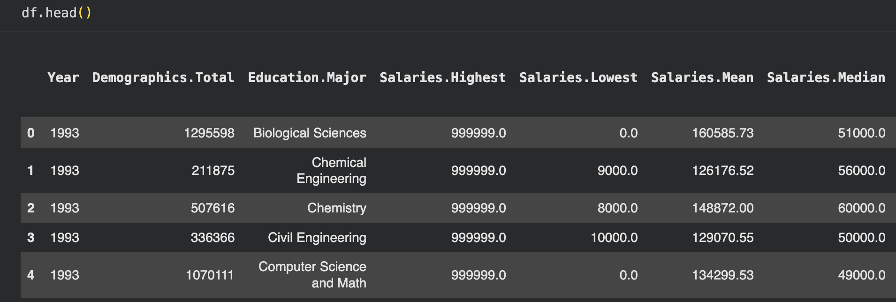
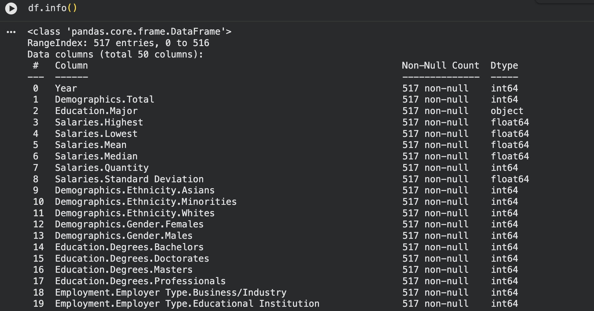
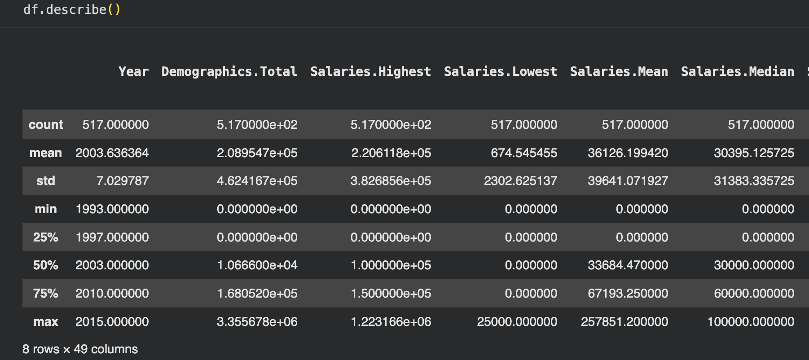
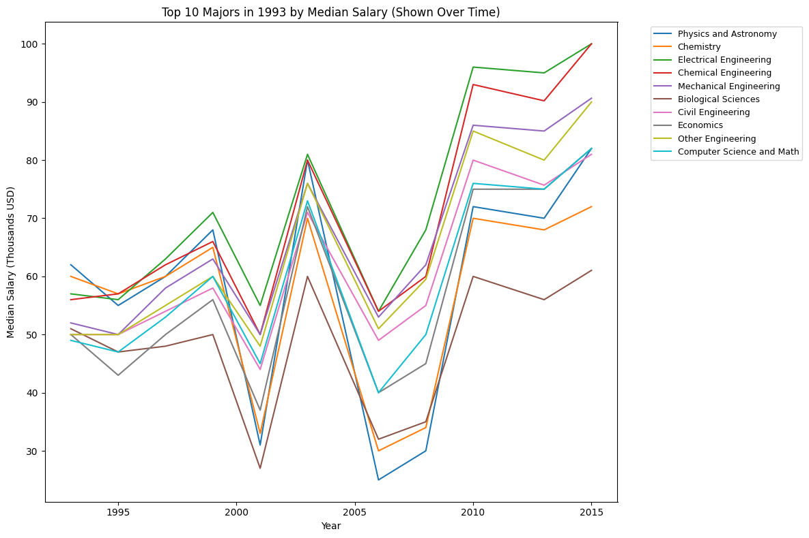
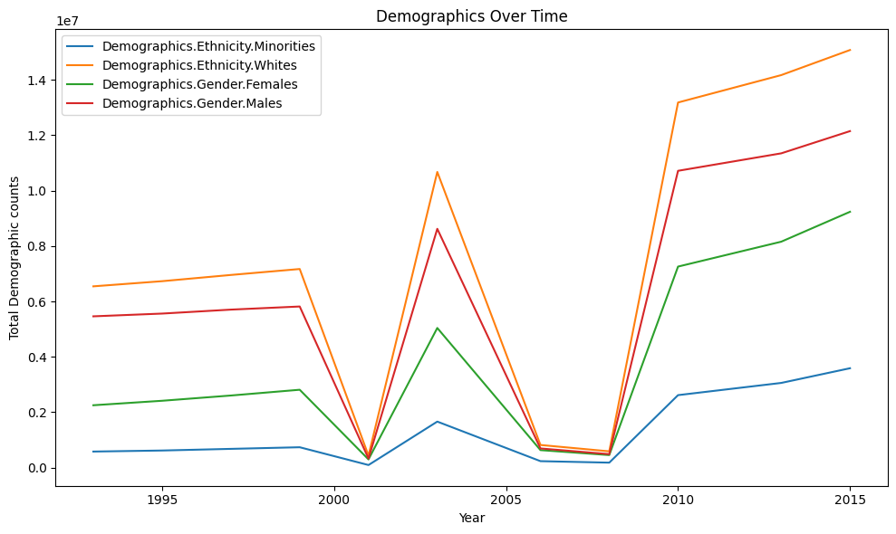
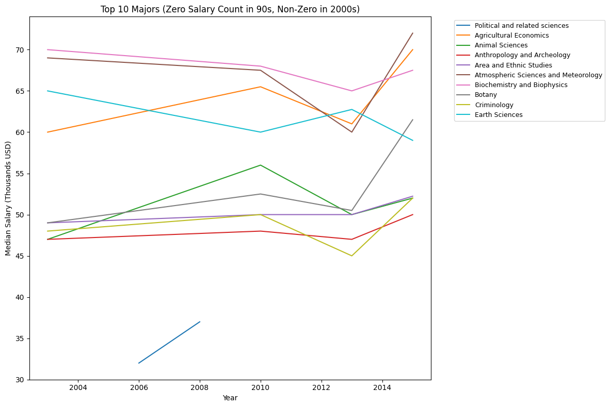
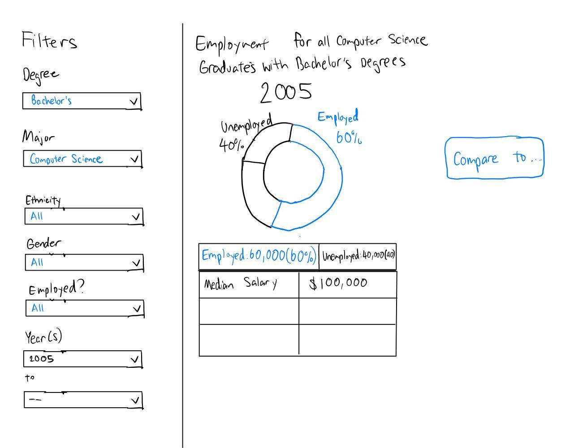
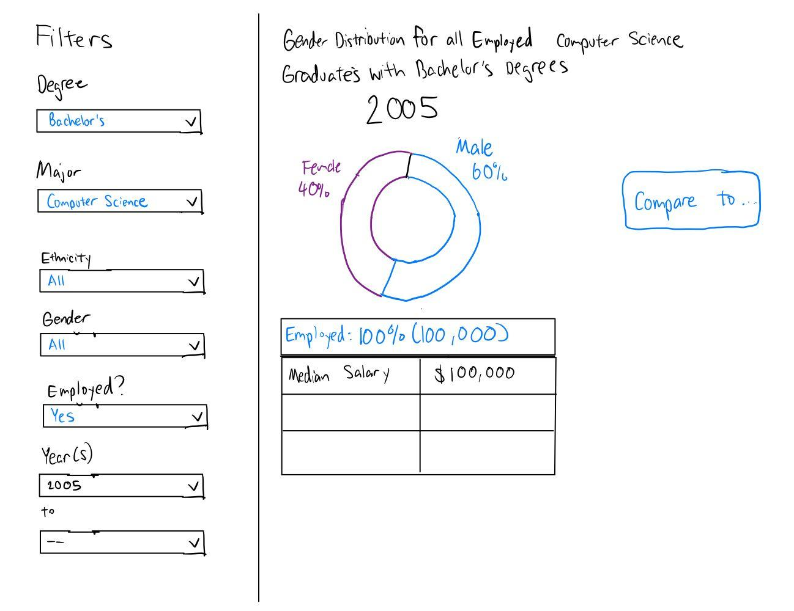
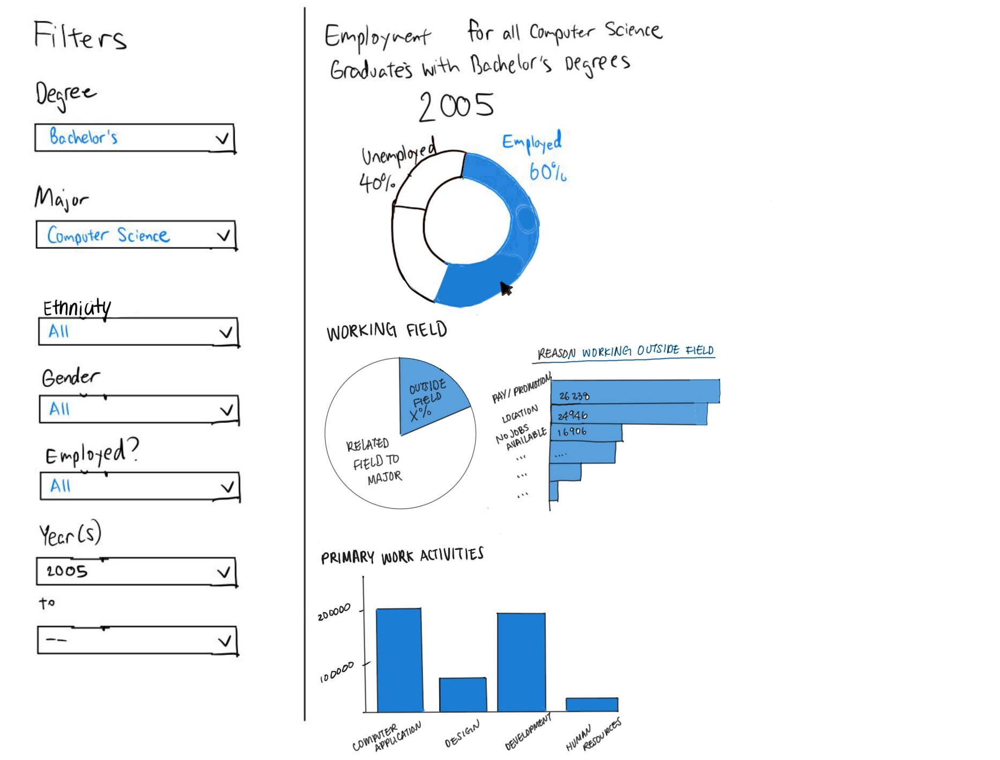
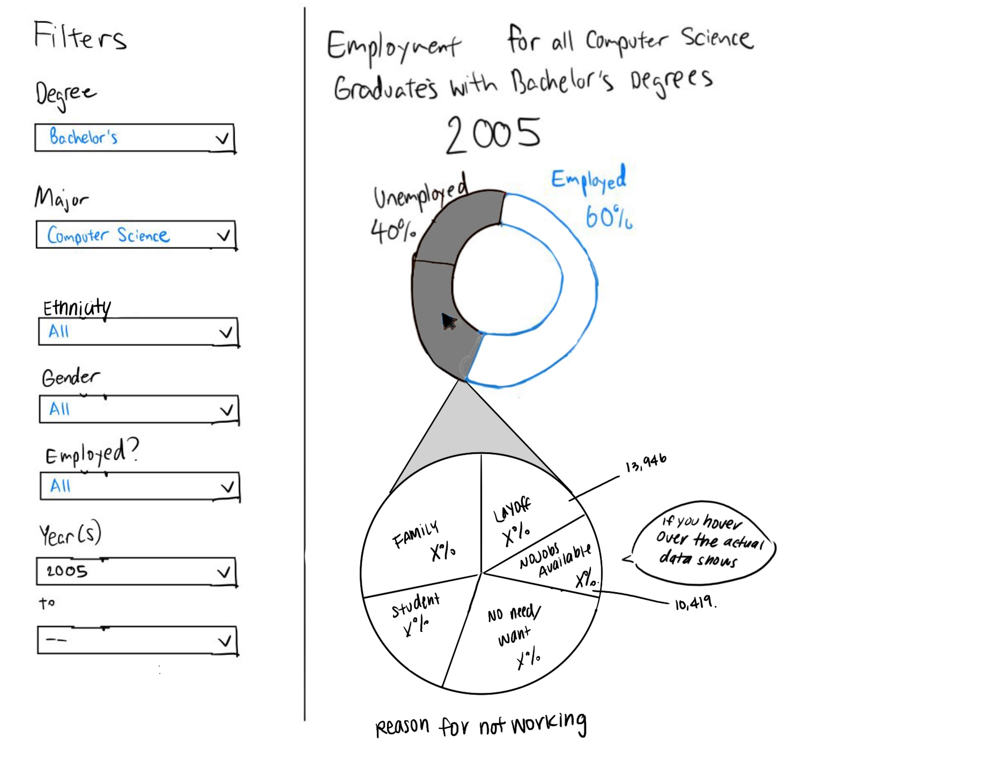

# New Grad Opportunities Visualization Project

## Project Proposal

### Team Members: Victor Wang, Sarah Yun, Mark Pindur, Ojas Vashishtha

Our project proposal involves working with a dataset regarding employment from the CORGIS Dataset Project. The data in this library comes from the National Survey of Recent College Graduates, and it is accessible and downloadable straight from the hyperlinked website. This dataset includes fields such as the major and degree for graduated students, salaries, demographic information, employment status, reasons for unemployment and industry of employment.

The big problem that we plan to address is the difficulty students face when trying to navigate the confusing and intimidating new grad market. We want them to be able to visualize and compare the new grad opportunities and how the landscape of the pipeline from graduation to industry has changed over the years. As students, we understand the benefit of this information being available and accessible - and will seek to present it in such a way where similar job-seeking students can extract the most value out of our interactive visualizations - making it easy and intuitive to use. We could show how many graduates in a specific field either are unemployed, end up in a job similar to the field they studied in, end up in a job different from a field they studied in, and how long it took for them to find the job. One way we can show this comparison is to have two separate visualizations of different years side by side, allowing the user to pick the years they want to compare. Another visualization could provide more context behind the employment trends by comparing the different reasons for unemployment and how this is affected in correlation to the specific majors or field of study.

One potential other data source we could try to include is to compare the graduate employment rate for a certain year to the national average by pulling occupation or industry data from the Bureau of Labor Statistics. Additionally, we can find more information on where new entrants move for their first employment with more geographic data by state or metropolitan area. We could visualize this information with a map and visualize the migration pattern over time.

Overall, we feel there is real value in this project not only to present students, but for anyone seeking to understand the larger picture of new-grad opportunities and how they have changed over time.

## Sketches and Data Analysis

### Data Processing

The CORGIS Graduates dataset is mostly clean, so we will not need too many cleaning steps. We have run checks such as viewing the first rows, checking column types, and looking at basic statistics to make sure the data looks right and there are no hidden problems like duplicates or strange text values. There are also no null values. There are some majors which have either 0 counts or unreasonably high counts across all columns. For these majors, we will likely not include them in any visualizations if that year is included. However, for many of these majors, data populates in later years. Some small conversions will help calculations, for example we will convert salary and other numeric columns to numpy numeric types, convert year fields to integers, and normalize text columns. From the data (means and standard deviations are provided) we will derive salary quartiles (25th, 50th, 75th), top-percentile cutoffs (top 5% and top 10%), and year over year salary changes. We may also compute z-scores or other normalized values to compare across majors. Our data processing stage will use Numpy and Pandas: Pandas for reading, grouping, and aggregating, and Numpy for numeric work and percentiles when needed. We will compute grouped aggregates by year and major and build a Streamlit app that lets users filter by year or major and that updates charts and tables automatically, with the backend using the Streamlit API to update visualizations. Screenshots of data exploration below:

### System Design

We plan to display our data using filters on the left side of the screen, some tables to display stats, and then a pie chart to display the main important information. Users can filter for specific types of information they're looking for, compare data between two different years, and hover over parts of the pie chart to view a deeper level of data like the number of people, distribution of different reasons, and other categories. Users can directly compare between two different years by clicking on the "compare to" button under the same applied filters.

If the user is hovering over the "Employed" section of the pie chart then it will showing the following graphs:

If the user is hovering over the "Unemployed" section of the pie chart then:

